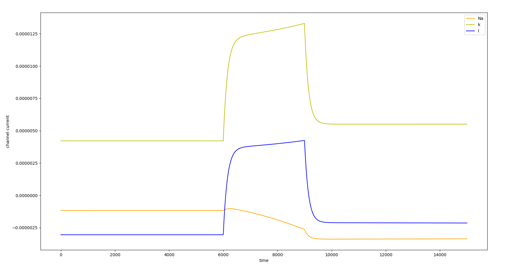
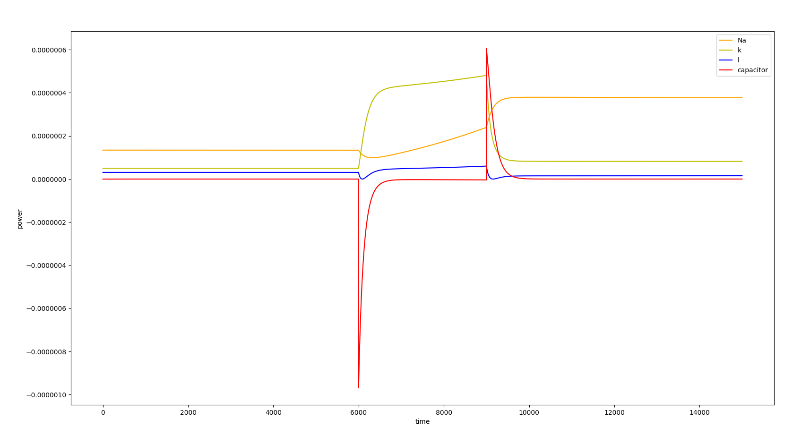
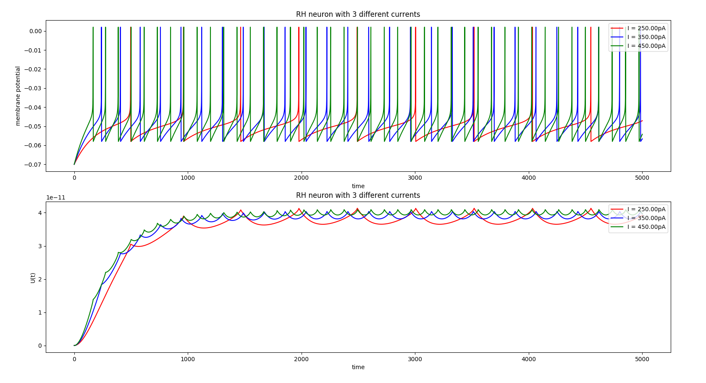
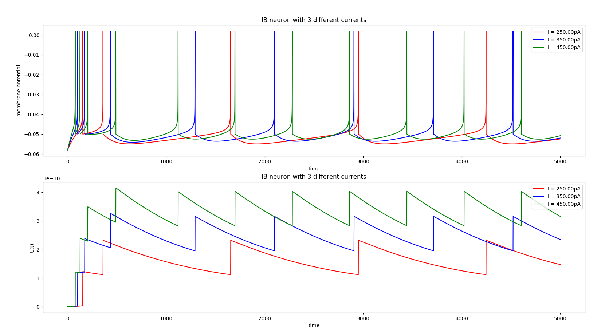
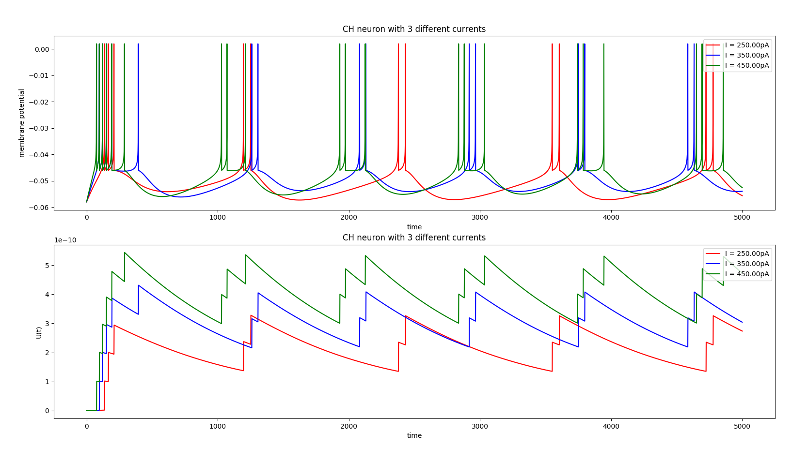
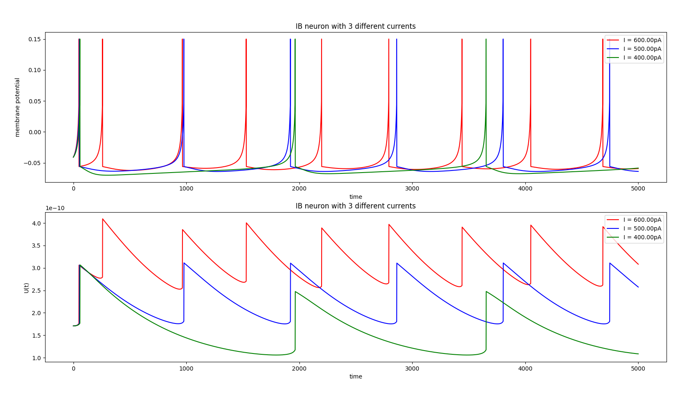
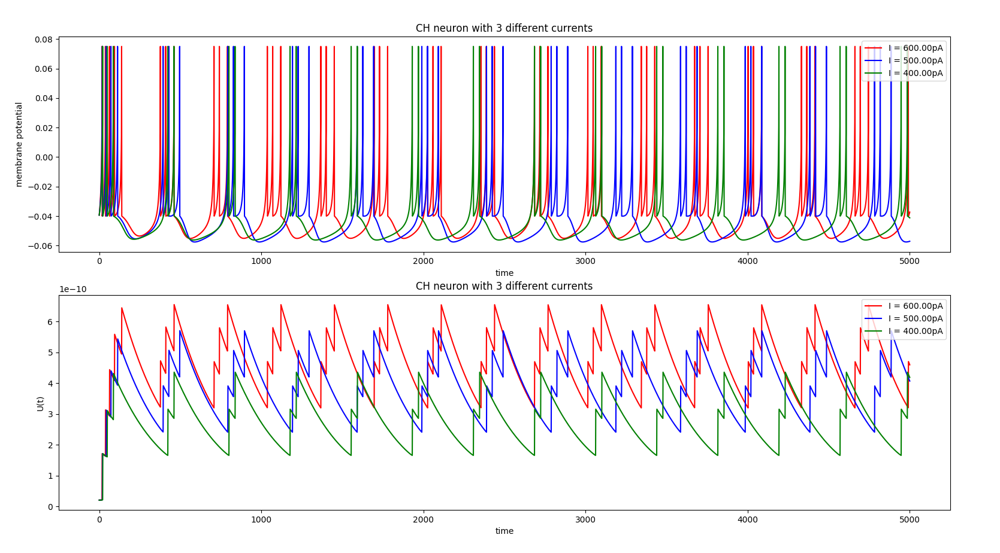
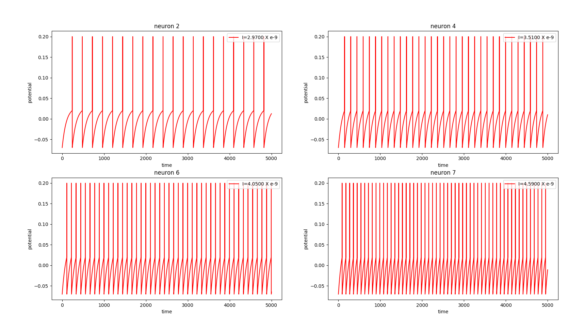

# Neuromorphic-Computing
Codes from scratch for the intro to neuromorphic computing

# Background story
**2nd Generation ANN** consists of neurons, which sum up the input signals and apply non-linear activation functions on them, then using backpropagation the weights of the link between neurons can be learnt. While this has worked very well so far, it is unlikely to capture the workings of a real biological neuron or the real neural network in human brains. **3rd Generation Neural Networks** try to mimic the biological neural networks better. To understand this new framework we can split it into 3 major components : **Neurons, Synapes, Networks**

# Neurons
Many different types of neuronal models are proposed, all of which try to capture the features of biological neurons. In this context, model is usually a set of ordinary differential equation(s) (it maybe a single ODE with constraints or coupled ODEs with constraints). Some of the famous yet simple models are:

* **Hodgkin-Huxley (HH)**

    This was designed by studying neurons from giant squid. It's a set of coupled differential equation which mimics the variation in conducatance of different ion-channels in the neurons well (which are essential for spike generation. ***Oh yes, 3rd generation networks feed on spikes, that is, token of information here is spike in membrane potential of the neurons. Information/signal is passed from one neuron to another in terms of spikes***). find out more about the theory here.

    
    
    

Although HH models seems to capture many things very well, for practial use cases it's not scalable as it has many coupled equations at play. In order to reduce the complexity (and hence computational time/cost) several alternate models were proposed. These are less complicated than HH, but they come at the cost that, there needs to be a manual check condition which ensures resetting of potentials and latent variables once the hit a require threshold (these things were taken care of in the equations itself in HH model). Some more models in reverse order of complexities:

* **Adaptive Exponential Integrate (AEF)**
    
    
    

* **IZHIKEVICH**
    
    
    

* **Leaky Integrate and Fire (LIF)**
    

